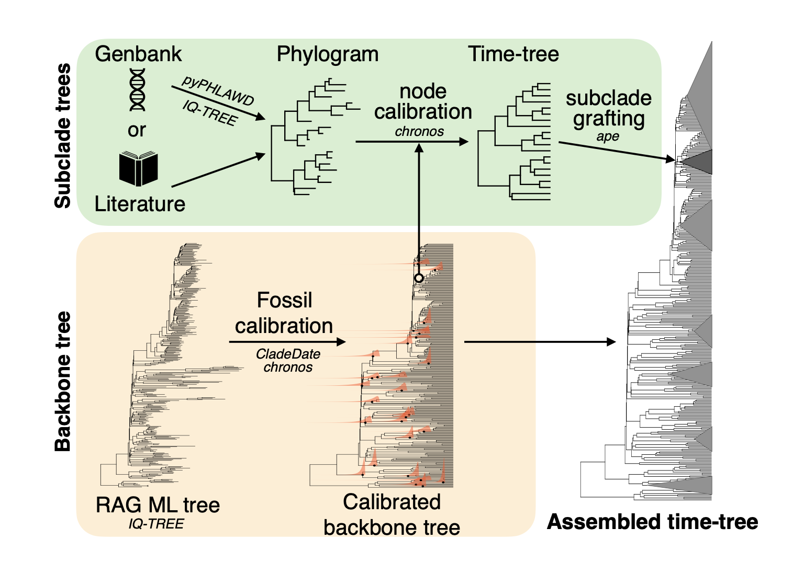

# Big Bird Tree Project

The code in this repository is used to assemble a comprehensive time-tree of birds inclusing most extant species and several extinc species. The strategy is to build a time-scaled "backbone" tree using maximum likelihood time-tree estimation methods and calibration densities derived from the fossil record using the `CladeDate` package in R (Claramunt 2022). The tree is then completed using subclade phylogenies from the literaure or newly inferred from sequence data in GenBank, which are time-scaled or re-scaled based on shared nodes with the backnone tree, and then grafted into the backnone tree. See Claramunt et al. (2025) for further details.



## Current Version: RAG genes backbone

The current version uses a backbnone tree of all bird families inferred from an alignment of Recombination Activation Genes (RAG1 and RAG2). The backbone tree was time-scaled using 33 calibration nodes with calibration densities derived from the fossil record using the `CladeDate` package in R (Claramunt 2022). Time scaling was performed using `chronos` (Paradis 2013).

Phylogenies of subclades were newly inferred from sequences deposited in GenBank using PyPHLAWD (Smith & Walker 2019) or obtained from previous studies as follow: Tinamidae (Almeida et al., 2022), Galliformes (Kimball et al., 2021), Charadriiformes (Černý & Natale, 2022), Coraciiformes (McCullough et al., 2019), Picidae (Shakya et al., 2017), Psittaciformes (Smith et al., 2023), Tyranni (Harvey et al., 2020), Melliphagidae (Marki et al., 2017), Corvides (McCullough et al., 2022) Sylvioidea (Cai et al., 2019), Alaudidae (Alström et al., 2023), Pycnonotidae (Shakya & Sheldon, 2017), Ploceidae (De Silva et al., 2019), Estrildidae (Olsson & Alström, 2020) and Emberizoidea (Barker et al., 2015). Subclades were then grafted into the the backbone tree after time scaling based on a shared node in the backbone tree. See Claramunt et al. (2025) for further details.

Current versions of the tree:

-BBtree.tre  Raw tree resulting form the assembling process.

-BBtree2.tre  Binary tree with no zero or near-zero branch lengths.

-BBtree3.tre Cleaned taxonomy for typos and outdated names with help from the Hosner et al. (2022) database.

-BBtreeC2022.tre Primary matching of the Clements/eBird 2022 taxonomy using Hosner et al. (2022).

If you use any of these trees in a pulication, please cite:
- Claramunt, S., C. Sheard, J. W. Brown, G. Cortés-Ramírez, J. Cracraft, M. Su, B. C. Weeks & J. A. Tobias (2025) A new time-tree of birds reveals the interplay between dispersal, geographic range size, and diversification. Current Biology. https://10.1016/j.cub.2025.07.004


## Importing trees into R

This code shows an example of how to directly import a tree into R:

```
library(ape)

github.directory <- "https://raw.githubusercontent.com/evolucionario/BigBirdTree/refs/heads/main/"

stage <- "RAGBackbone/"

tree <- "BBtree2.tre"

url <- paste0(github.directory, stage, tree)

BBtree2 <- read.tree(url)
```


## References

- Almeida, F. C., Porzecanski, A. L., Cracraft, J. L., & Bertelli, S. (2022). The evolution of tinamous (Palaeognathae: Tinamidae) in light of molecular and combined analyses. Zoological Journal of the Linnean Society, 195(1), 106–124. https://doi.org/10.1093/zoolinnean/zlab080
- Alström, P., Mohammadi, Z., Enbody, E. D., Irestedt, M., Engelbrecht, D., Crochet, P.-A., Guillaumet, A., Rancilhac, L., Tieleman, B. I., Olsson, U., Donald, P. F., & Stervander, M. (2023). Systematics of the avian family Alaudidae using multilocus and genomic data. Avian Research, 14(2), 100095–100095. https://doi.org/10.1016/j.avrs.2023.100095
- Barker, F. K., Burns, K. J., Klicka, J., Lanyon, S. M., & Lovette, I. J. (2015). New insights into New World biogeography: An integrated view from the phylogeny of blackbirds, cardinals, sparrows, tanagers, warblers, and allies. The Auk, 132(2), 333–348. https://doi.org/10.1642/AUK-14-110.1
- Cai, T., Cibois, A., Alström, P., Moyle, R. G., Kennedy, J. D., Shao, S., Zhang, R., Irestedt, M., Ericson, P. G. P., Gelang, M., Qu, Y., Lei, F., & Fjeldså, J. (2019). Near-complete phylogeny and taxonomic revision of the world’s babblers (Aves: Passeriformes). Molecular Phylogenetics and Evolution, 130, 346–356. https://doi.org/10.1016/j.ympev.2018.10.010
- Černý, D., & Natale, R. (2022). Comprehensive taxon sampling and vetted fossils help clarify the time tree of shorebirds (Aves, Charadriiformes). Molecular Phylogenetics and Evolution, 177, 107620. https://doi.org/10.1016/j.ympev.2022.107620
- Claramunt, S. (2022). CladeDate: Calibration information generator for divergence time estimation. Methods in Ecology and Evolution, 13(11), 2331–2338. https://doi.org/10.1111/2041-210X.13977
- Claramunt, S., C. Sheard, J. W. Brown, G. Cortés-Ramírez, J. Cracraft, M. Su, B. C. Weeks & J. A. Tobias (2025) A new time-tree of birds reveals the interplay between dispersal, geographic range size, and diversification. Current Biology. https://10.1016/j.cub.2025.07.004
- De Silva, T. N., Peterson, A. T., & Perktas, U. (2019). An extensive molecular phylogeny of weaverbirds (Aves: Ploceidae) unveils broad nonmonophyly of traditional genera and new relationships. The Auk, 136(3), ukz041. https://doi.org/10.1093/auk/ukz041
- Harvey, M. G., Bravo, G. A., Claramunt, S., Cuervo, A. M., Derryberry, G. E., Battilana, J., Seeholzer, G. F., McKay, J. S., O’Meara, B. C., Faircloth, B. C., Edwards, S. V., Pérez-Emán, J., Moyle, R. G., Sheldon, F. H., Aleixo, A., Smith, B. T., Chesser, R. T., Silveira, L. F., Cracraft, J., … Derryberry, E. P. (2020). The evolution of a tropical biodiversity hotspot. Science, 370(6522), 1343–1348. https://doi.org/10.1126/science.aaz6970
- Hosner, P. A., Zhao, M., Kimball, R. T., Braun, E. L., & Burleigh, J. G. (2022). Updating splits, lumps, and shuffles: Reconciling GenBank names with standardized avian taxonomies. Ornithology, 139(4), ukac045. https://doi.org/10.1093/ornithology/ukac045
- Kimball, R. T., Hosner, P. A., & Braun, E. L. (2021). A phylogenomic supermatrix of Galliformes (Landfowl) reveals biased branch lengths. Molecular Phylogenetics and Evolution, 158, 107091. https://doi.org/10.1016/j.ympev.2021.107091
- Marki, P. Z., Jønsson, K. A., Irestedt, M., Nguyen, J. M. T., Rahbek, C., & Fjeldså, J. (2017). Supermatrix phylogeny and biogeography of the Australasian Meliphagides radiation (Aves: Passeriformes). Molecular Phylogenetics and Evolution, 107, 516–529. https://doi.org/10.1016/j.ympev.2016.12.021
- McCullough, J. M., Moyle, R. G., Smith, B. T., & Andersen, M. J. (2019). A Laurasian origin for a pantropical bird radiation is supported by genomic and fossil data (Aves: Coraciiformes). Proceedings of the Royal Society B: Biological Sciences, 286(1910), 20190122. https://doi.org/10.1098/rspb.2019.0122
- McCullough, J. M., Oliveros, C. H., Benz, B. W., Zenil-Ferguson, R., Cracraft, J., Moyle, R. G., & Andersen, M. J. (2022). Wallacean and Melanesian islands promote higher rates of diversification within the global passerine radiation Corvides. Systematic Biology, 71(6), 1423–1439. https://doi.org/10.1093/sysbio/syac044
- Olsson, U., & Alström, P. (2020). A comprehensive phylogeny and taxonomic evaluation of the waxbills (Aves: Estrildidae). Molecular Phylogenetics and Evolution, 146, 106757. https://doi.org/10.1016/j.ympev.2020.106757
- Paradis, E. (2013) Molecular dating of phylogenies by likelihood methods: a comparison of models and a new information criterion. Molecular Phylogenetics and Evolution, 67, 436–444. https://doi.org/10.1016/j.ympev.2013.02.008
- Reddy, S., Kimball, R. T., Pandey, A., Hosner, P. A., Braun, M. J., Hackett, S. J., Han, K.-L., Harshman, J., Huddleston, C. J., Kingston, S., Marks, B. D., Miglia, K. J., Moore, W. S., Sheldon, F. H., Witt, C. C., Yuri, T., & Braun, E. L. (2017). Why do phylogenomic data dets yield conflicting trees? Data type influences the avian tree of life more than taxon sampling. Systematic Biology, 66(5), 857–879. https://doi.org/10.1093/sysbio/syx041
- Shakya, S. B., Fuchs, J., Pons, J.-M., & Sheldon, F. H. (2017). Tapping the woodpecker tree for evolutionary insight. Molecular Phylogenetics and Evolution, 116, 182–191. https://doi.org/10.1016/j.ympev.2017.09.005
- Shakya, S. B., & Sheldon, F. H. (2017). The phylogeny of the world’s bulbuls (Pycnonotidae) inferred using a supermatrix approach. Ibis, 159(3), 498–509. https://doi.org/10.1111/ibi.12464
- Smith, B. T., Merwin, J., Provost, K. L., Thom, G., Brumfield, R. T., Ferreira, M., Mauck, W. M., III, Moyle, R. G., Wright, T. F., & Joseph, L. (2023). Phylogenomic analysis of the parrots of the world distinguishes artifactual from biological sources of gene tree discordance. Systematic Biology, 72(1), 228–241. https://doi.org/10.1093/sysbio/syac055
- Smith, S. A., & Walker, J. F. (2019). PyPHLAWD: A python tool for phylogenetic dataset construction. Methods in Ecology and Evolution, 10(1), 104–108. https://doi.org/10.1111/2041-210X.13096
